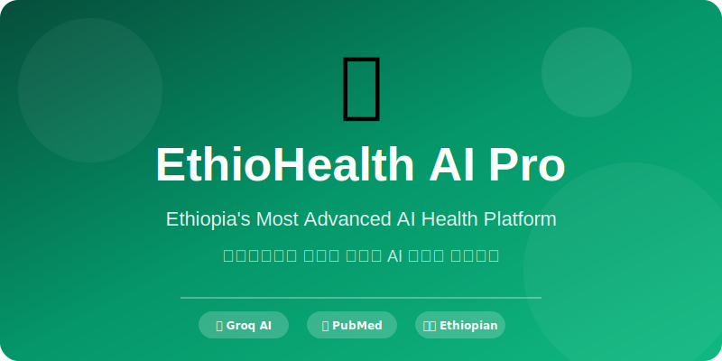

<div align="center">


<br />
<br />

# 🧬 EthioHealth AI Pro | ኢትዮሄልዝ AI ፕሮ

### Ethiopia's Most Advanced AI-Powered Health Platform
### የኢትዮጵያ እጅግ የላቀ AI የታገዘ የጤና መድረክ

<p align="center">
</p>

---

<div style="display: flex; justify-content: center; gap: 12px; flex-wrap: wrap; margin: 20px 0;">

<span style="background: #f0fdf4; color: #059669; padding: 8px 16px; border-radius: 20px; font-weight: 600;">🤖 Groq AI Powered</span>
<span style="background: #eff6ff; color: #3b82f6; padding: 8px 16px; border-radius: 20px; font-weight: 600;">📚 PubMed Research</span>
<span style="background: #fef3c7; color: #d97706; padding: 8px 16px; border-radius: 20px; font-weight: 600;">💊 OpenFDA Drugs</span>
<span style="background: #f5f3ff; color: #7c3aed; padding: 8px 16px; border-radius: 20px; font-weight: 600;">🌿 Traditional Medicine</span>
<span style="background: #fef2f2; color: #dc2626; padding: 8px 16px; border-radius: 20px; font-weight: 600;">🇪🇹 Ethiopian First</span>

</div>

---

<br />

[](https://github.com/YOUR_USERNAME/EthioHealth-AI-Pro)
[](https://github.com/YOUR_USERNAME/EthioHealth-AI-Pro/fork)

</div>

---

## 📑 Table of Contents | ይዘት ማውጫ

| # | English | አማርኛ |
|---|---------|--------|
| 1 | [Overview](#-overview) | [አጠቃላይ እይታ](#-overview) |
| 2 | [Features](#-features) | [ባህሪያት](#-features) |
| 3 | [Why EthioHealth AI?](#-why-ethiohealth-ai) | [ለምን ኢትዮሄልዝ AI?](#-why-ethiohealth-ai) |
| 4 | [Tech Stack](#-tech-stack) | [ቴክኖሎጂ](#-tech-stack) |
| 5 | [Installation](#-installation) | [መጫኛ](#-installation) |
| 6 | [Project Structure](#-project-structure) | [የፕሮጀክት መዋቅር](#-project-structure) |
| 7 | [API Configuration](#-api-configuration) | [API ውቅር](#-api-configuration) |
| 8 | [Screenshots](#-screenshots) | [ቅጽበተ ፎቶዎች](#-screenshots) |
| 9 | [Contributing](#-contributing) | [አስተዋጽኦ](#-contributing) |
| 10 | [License](#-license) | [ፍቃድ](#-license) |

---

## 🌟 Overview | አጠቃላይ እይታ

<div align="center">

### 🧬 Reduce Prescription by Understanding Disease
### በሽታን በመረዳት ማዘዣን ይቀንሱ

</div>

**EthioHealth AI Pro** is a revolutionary healthcare platform designed specifically for Ethiopia. It combines artificial intelligence (Groq AI), medical research databases (PubMed), drug information (OpenFDA), and traditional Ethiopian medicine to provide **doctor-level health analysis** accessible to everyone, everywhere.

**ኢትዮሄልዝ AI ፕሮ** በተለይ ለኢትዮጵያ የተዘጋጀ አብዮታዊ የጤና መድረክ ነው። አርቲፊሻል ኢንተሊጀንስ (Groq AI)፣ የህክምና ምርምር ዳታቤዞች (PubMed)፣ የመድሃኒት መረጃ (OpenFDA) እና ባህላዊ የኢትዮጵያ ህክምናን በማጣመር ለሁሉም ተደራሽ የሆነ **የዶክተር ደረጃ የጤና ትንተና** ያቀርባል።

---

## ✨ Features | ባህሪያት

<div align="center">

| 🔬 **AI-Powered Diagnosis** | 🩺 **Symptom Checker** | 🌿 **Traditional Medicine** |
|:---:|:---:|:---:|
| Groq AI doctor-level analysis | Interactive body map | 50+ Ethiopian herbs |
| ICD-10 disease coding | 200+ selectable symptoms | Scientific validation |
| Differential diagnosis | Holistic (body/mind/spirit) | Safety warnings & interactions |

<br />

| 🎤 **Voice Assistant** | 🌍 **Multilingual** | 📱 **Offline First** |
|:---:|:---:|:---:|
| Speech-to-text in 3 languages | English | Works without internet |
| AI voice responses | አማርኛ (Amharic) | Local database storage |
| Health command execution | Afaan Oromoo (Oromo) | Zero data leaves device |

</div>

### 🏥 Doctor-Level Diagnosis Features | የዶክተር ደረጃ ምርመራ ባህሪያት

- ✅ **500+ Detectable Conditions** | **500+ ሊታወቁ የሚችሉ ህመሞች**
- ✅ **ICD-10 Medical Coding** | **ICD-10 የህክምና ኮድ**
- ✅ **Confidence Scoring (1-100%)** | **የእርግጠኝነት ደረጃ (1-100%)**
- ✅ **Differential Diagnosis** | **ልዩ ምርመራ**
- ✅ **Treatment Recommendations** | **የህክምና ምክሮች**
- ✅ **Complication Warnings** | **የችግር ማስጠንቀቂያዎች**
- ✅ **Follow-up Plans** | **የክትትል እቅዶች**

### 🌿 Ethiopian Traditional Medicine | የኢትዮጵያ ባህላዊ ህክምና

- 🌱 **50+ Documented Herbs** | **50+ የተመዘገቡ እፅዋት**
- 📝 **Scientific Names & Families** | **ሳይንሳዊ ስሞች እና ቤተሰቦች**
- 🔧 **Preparation Methods** | **የአዘገጃጀት ዘዴዎች**
- ⚖️ **Dosage Guidelines** | **የመጠን መመሪያዎች**
- ⚠️ **Safety Warnings & Drug Interactions** | **የደህንነት ማስጠንቀቂያዎች እና የመድሃኒት መስተጋብር**
- 📍 **Growing Regions in Ethiopia** | **በኢትዮጵያ የሚበቅሉባቸው ክልሎች**

---

## 🎯 Why EthioHealth AI? | ለምን ኢትዮሄልዝ AI?

<div align="center">

| ❌ **Without EthioHealth** | ✅ **With EthioHealth AI** |
|:---|:---|
| Wait days for doctor appointment | **Instant AI analysis** |
| Language barrier with doctors | **Amharic, Oromo, English** |
| No access to medical research | **PubMed evidence-based** |
| Expensive consultations | **Free and accessible** |
| No traditional medicine info | **Validated herb database** |
| Internet required | **Works 100% offline** |
| Limited to urban areas | **Available everywhere** |

</div>

### Our Mission | ተልዕኳችን

> "To democratize healthcare in Ethiopia by making doctor-level diagnosis accessible to every person, in their language, anytime, anywhere."

> "የዶክተር ደረጃ ምርመራን ለእያንዳንዱ ሰው፣ በራሱ ቋንቋ፣ በማንኛውም ጊዜ፣ በማንኛውም ቦታ ተደራሽ በማድረግ በኢትዮጵያ የጤና አገልግሎትን ዴሞክራሲያዊ ማድረግ።"

---

## 🛠 Tech Stack | ቴክኖሎጂ

<div align="center">

| Category | Technology | Purpose |
|:---|:---|:---|
| 🤖 **AI Engine** | Groq API (Llama 3.3 70B) | Medical reasoning & diagnosis |
| 📚 **Research** | PubMed E-utilities API | Evidence-based medicine |
| 💊 **Drug Data** | OpenFDA API | Drug information & safety |
| 🗄️ **Database** | Dexie.js (IndexedDB) | Offline local storage |
| 🌍 **i18n** | i18next.js | Multilingual support |
| 📊 **Charts** | Chart.js | Health trend visualization |
| 🎤 **Voice** | Web Speech API | Speech recognition & TTS |
| 📱 **Platform** | Android WebView | Native app container |
| 🎨 **UI** | Vanilla JS + CSS3 | Responsive & animated |

</div>

---

## 📦 Installation | መጫኛ

### Prerequisites | ቅድመ ሁኔታዎች

- A web browser (Chrome/Firefox/Edge) | የድር ማሰሻ (Chrome/Firefox/Edge)
- (Optional) Groq API Key for AI features | (እንደአማራጭ) ለAI ባህሪያት Groq API ቁልፍ
- (Optional) Android Studio for native app | (እንደአማራጭ) ለኔቲቭ መተግበሪያ Android Studio

### Quick Start | ፈጣን ጅምር

```bash
# Clone the repository
# ሪፖዚቶሪውን ይቅዱ
git clone https://github.com/Melkamukebede/AI-ML-deveeloper.git
cd EthioHealth-AI-Pro

# Navigate to the web app
# ወደ ድር መተግበሪያው ይሂዱ
cd assets/ethiohealth

# Serve locally (choose one)
# በአካባቢያዊ አገልጋይ ያስኬዱ (አንዱን ይምረጡ)

# Option 1: Python
python -m http.server 8000

# Option 2: Node.js
npx serve .

# Option 3: PHP
php -S localhost:8000

# Then open: http://localhost:8000
# ከዚያ ይክፈቱ: http://localhost:8000
